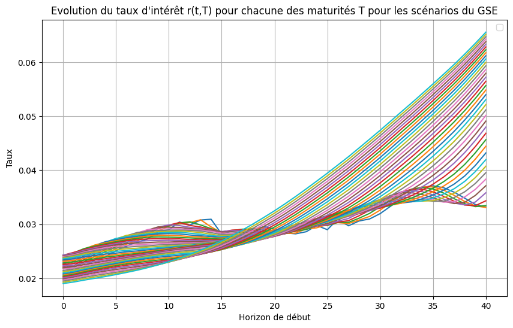
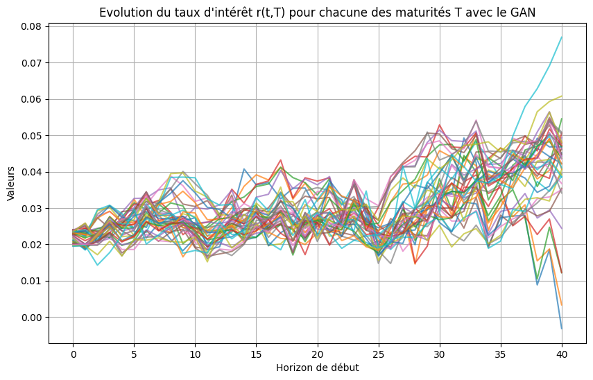
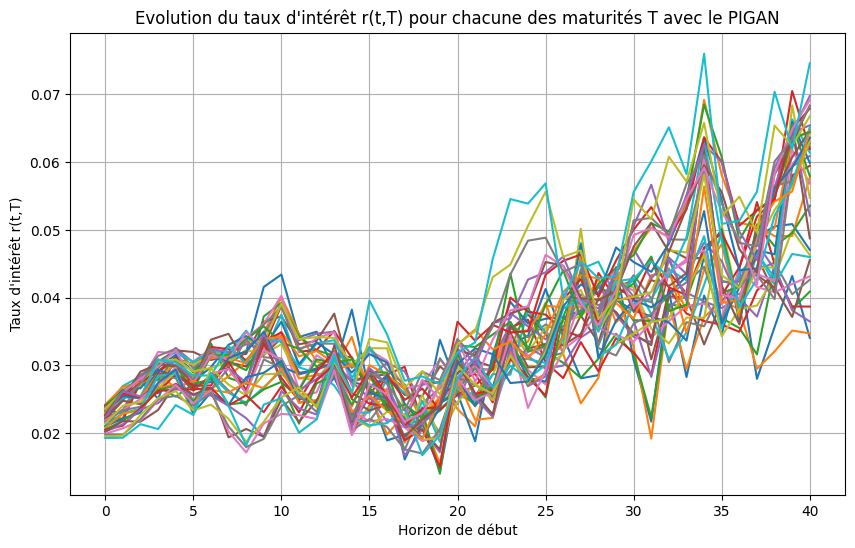
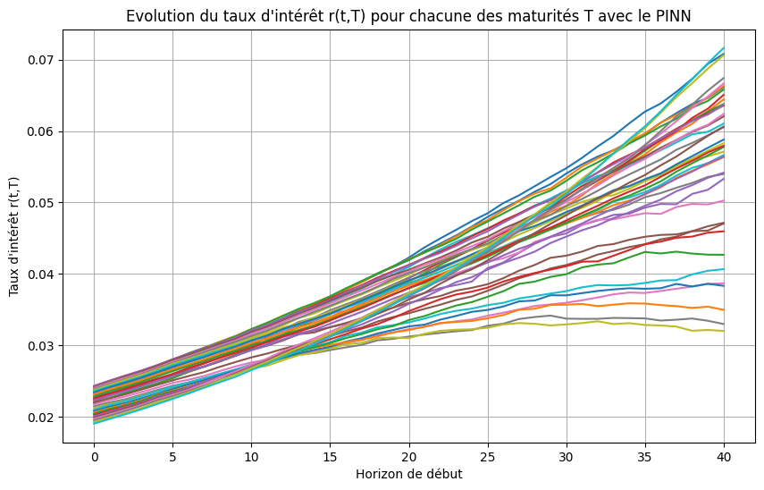

# Génération de Scénarios Economiques avec IA Générative

## 📌 Contexte
Ce projet a été réalisé dans le cadre d'un projet de recherche à l’ENSAE sur l'année 2024-2025 en collaboration avec WTW.  
L’objectif était d’explorer comment des **modèles d’IA générative** peuvent **compléter ou remplacer un GSE (Generateur de Scénarios Économiques)** pour produire des scénarios de taux d’intérêt forward conformes aux contraintes réglementaires et métiers.

Les assureurs ont besoin de tels scénarios pour la gestion actif-passif, la solvabilité et le pilotage des risques.  
Traditionnellement, on utilise un **Libor Market Model (LMM)** calibré avec des données de marché. Ici, nous avons cherché à tester si des modèles d’IA générative pouvaient :  
- reproduire des trajectoires réalistes de taux,  
- respecter les contraintes financières (martingales, corrélations, volatilités),  
- et potentiellement réduire la dépendance aux données de marché.

---

## 🏗️ Structure du projet
- `Presentation_experiences.pdf` : présentation du projet.  
- `PINN.ipynb` : implémentation d’un **Physics-Informed Neural Network** pour l’estimation inverse des paramètres du LMM (σ, ρ).  
- `PIGAN.ipynb` : tentative d’implémentation d’un **Physics-Informed GAN** combinant contraintes de marché et adversarial learning.  
- `GAN-2.ipynb` : implémentation d’un **GAN standard** pour générer des scénarios stochastiques.  
- `resultsPINN.png`, `resultsPIGAN.png`, `resultsGSE.png`, `resultsGAN.png` : graphiques des résultats comparatifs.  

---

## 🔬 Méthodologie
### 1. GSE – Générateur de Scénarios Économiques
Le modèle classique utilise le **Libor Market Model** pour simuler des trajectoires de taux forward :  

- Calibration à partir de la courbe des taux initiale.  
- Utilisation de la dynamique lognormale avec corrélations imposées via décomposition de Cholesky.  
- Génération de scénarios stochastiques sous mesure risque-neutre.  

👉 Le GSE sert de **référence** : les modèles d’IA doivent approcher ses sorties. On cherche à produire des trajectoires qui ressemblent à :

### 2. GAN – Generative Adversarial Network
- Générateur (MLP) et Discriminateur (LSTM).  
- Objectif : produire des scénarios ressemblant à ceux du GSE.  
- Limites : difficulté à respecter les contraintes financières → sorties bruitées.  

### 3. PIGAN – Physics-Informed GAN
- Variante du GAN avec contrainte supplémentaire : les scénarios générés doivent respecter les équations différentielles stochastiques du LMM.  
- En pratique : résultats instables, beaucoup d’hyperparamètres à calibrer.  

### 4. PINN – Physics-Informed Neural Network
- Approche inverse : au lieu de générer directement, on **recalibre** les paramètres du LMM à partir des scénarios.  
- Estimation des volatilités σ(T) et corrélations ρ.  
- Permet ensuite de resimuler des scénarios cohérents.  

---

## 📊 Résultats comparatifs
- **GSE** : trajectoires lisses et économiquement cohérentes.  
- **GAN** : beaucoup de bruit, pas de structure financière claire.  
- **PIGAN** : instable, mais parfois plus réaliste que le GAN.  
- **PINN** : permet théoriquement de retrouver des paramètres financiers exploitables mais dans la pratique c'est plus difficile.  

---

## 🚀 Conclusion
- Les **GANs purs** sont trop génériques et peu adaptés aux contraintes financières.  
- Le **PIGAN** est prometteur, mais nécessite des calibrations poussées.  
- Le **PINN** est la méthode la plus robuste, car il inverse le problème et permet d’extraire les paramètres financiers directement.  

Ce projet ouvre la voie à une utilisation hybride :  
➡️ utiliser les **IA génératives** pour compléter le GSE, et non le remplacer totalement.   
